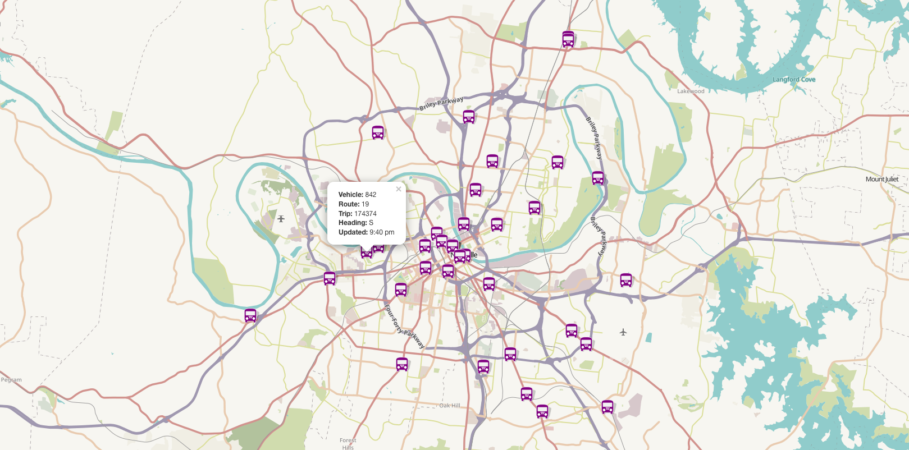

# WeGo Transit Map

[](https://github.com/transitnownash/wego-bus-map/actions/workflows/nodejs.yml) [](https://github.com/transitnownash/wego-bus-map/actions/workflows/codeql-analysis.yml)



Implementation of the General Transit Feed Specification (GTFS) Realtime feed for Nashville's WeGo Public Transit bus system. Displays all vehicle locations on a map.

Requires a [separate application](https://github.com/transitnownash/gtfs-rails-api) to be up and running for the static data components (route, shapes, trips, etc.) to work properly. Configure the endpoint as `GTFS_BASE_URL` in your environment.

## Development

Start the application with the default endpoint.

```bash
$ npm start
```

Run the test suite.

```bash
$ npm test
```

Build static app to `./build` folder.

```bash
$ npm run build
```
